# Pipelines

## Pipeline Ideia 01 - 01/09/2026

Estrutura em três partes: filtro de tecido, filtro de top-k patches, e extração de informação por patch (encoders e descritores) — reunida por patch e fornecida à VLM.

### Visão geral

```mermaid
flowchart LR
    A["0. Entrada<br/>WSI .svs/.tiff, 20x, tile 256px<br/>~10–40k tiles"]:::io --> B["1. Filtro de tecido<br/>Otsu / deconv. H&E → máscara<br/>~5–12k tiles"]:::stage
    B --> C["2. Roteador → top-k<br/>encoder leve + rank + dedup<br/>k = 8–32"]:::stage
    C --> D["3. Extração por patch<br/>descritor contrastivo + coordenada"]:::stage
    D -. "variante: reasoning+cache<br/>(não é o default)" .-> D2["VLM por patch<br/>achado em texto, sem diagnóstico"]:::variant
    D --> E["4. Agregação<br/>k blocos de texto + cabeçalho<br/>+ 1–3 âncoras visuais"]:::stage
    D2 -.-> E
    E --> F["5. Síntese na VLM<br/>MedGemma-4B / Quilt-LLaVA / LLaVA-Med, 4-bit"]:::model
    F --> G["Pré-laudo"]:::io

    classDef io fill:#9e9e9e,stroke:#616161,color:#fff
    classDef stage fill:#1e88e5,stroke:#1565c0,color:#fff
    classDef model fill:#43a047,stroke:#2e7d32,color:#fff
    classDef variant fill:#90caf9,stroke:#1565c0,color:#000,stroke-dasharray: 5 5
```



### 0. Entrada

WSI em .svs/.tiff piramidal. Magnificação de trabalho: 20× (padrão diagnóstico), tile de 256px. Uma lâmina em 20× vira ~10–40 mil tiles antes de filtrar.

### 1. Filtro de tecido

Princípio: fundo de lâmina é branco (baixa saturação, alto brilho); tecido é corado (saturação mais alta). Os dois são separados por um limiar num espaço de cor onde se distanciam — sempre sobre um thumbnail de baixa resolução, nunca no full-res (desperdício de custo computacional). Descarta fundo branco, que é 60–80% da lâmina; só tilifica dentro da máscara. Custo: CPU, desprezível. Saída: lista de coordenadas de tiles com tecido (de ~30 mil para ~5–12 mil).

#### Bibliotecas prontas

Caminho pragmático: não reinventar. Duas bibliotecas já fazem isso de forma robusta e são padrão no campo:

- **CLAM** (`create_patches_fp.py`, Mahmood Lab) — segmenta tecido, gera contornos e já tilifica. É o de-facto da área; opção sólida para um baseline rápido.
- **TIAToolbox** — `tiatoolbox.tools.tissuemask`, com `OtsuTissueMasker` e `MorphologicalMasker` prontos.
- **histolab** — também embrulha máscara de tecido de forma limpa.

#### Receita manual (Otsu sobre a saturação)

Para entender e controlar o processo — recomendado, já que os defaults das bibliotecas prontas erram em casos reais —, a receita manual é Otsu sobre a saturação, com OpenSlide + OpenCV/skimage:

```python
import openslide, cv2, numpy as np

slide = openslide.OpenSlide("lamina.svs")

# 1. thumbnail num nível baixo (~downsample 32-64x). NÃO no full-res.
level = slide.get_best_level_for_downsample(32)
img = np.array(slide.read_region((0,0), level, slide.level_dimensions[level]))[:, :, :3]

# 2. suaviza pra matar ruído/poeira
img = cv2.medianBlur(img, 7)

# 3. HSV: tecido tem S alto, fundo branco tem S baixo
hsv = cv2.cvtColor(img, cv2.COLOR_RGB2HSV)
S = hsv[:, :, 1]

# 4. Otsu na saturação -> máscara binária de tecido
_, mask = cv2.threshold(S, 0, 255, cv2.THRESH_BINARY + cv2.THRESH_OTSU)

# 5. limpeza morfológica: fecha buracos, remove ilhas pequenas
k = cv2.getStructuringElement(cv2.MORPH_ELLIPSE, (9, 9))
mask = cv2.morphologyEx(mask, cv2.MORPH_CLOSE, k)
mask = cv2.morphologyEx(mask, cv2.MORPH_OPEN, k)
```

Depois, a decisão é por tile: para cada patch candidato na magnificação de trabalho, projeta-se as coordenadas na máscara e mantém-se só se a fração de tecido passar de um limiar (tipicamente ≥ 0,5). Um jeito barato de fazer isso sem reler a máscara é checar por tile a fração de pixels quase-brancos ou a saturação média — se o tile é majoritariamente branco, descarta.

#### Armadilhas

Os defaults ignoram estes casos, que de fato aparecem em histopatologia:

- **Marca de caneta** (verde/azul/preto do patologista) tem saturação alta e passa como "tecido". Filtra por cor (faixa de matiz da caneta) antes do Otsu, ou remove os contornos grandes e coloridos que não são rosa/roxo de H&E.
- **Tecido adiposo** é pálido e de baixa saturação → o Otsu na saturação joga fora gordura. Se o adipócito importa para o diagnóstico, o limiar de saturação fica agressivo demais; combinar com um critério de brilho (V) em vez de só S.
- **Dobras de tecido** ficam escuras e viram falso-positivo denso; áreas fora de foco e bolhas de ar confundem.
- **Otsu global falha** em lâmina com tecido tênue ou gradiente de fundo. Nesse caso, um limiar fixo calibrado no scanner às vezes é mais confiável que o Otsu adaptativo.
- **O nível de downsample escolhido importa:** downsample demais (128×) perde tecido fino e bordas; de menos, desperdiça custo. 32–64× costuma ser o ponto de equilíbrio.

### 2. Roteador → top-k

É aqui que se decide quanto da lâmina é pago. Cada tile passa por um encoder/contrastivo barato (CTransPath 28M, Phikon 86M, ou um contrastivo tipo CONCH/PLIP/QuiltNet) e é ranqueado. O critério de ranking depende da tarefa — decisão de projeto, não detalhe:

- rótulo fixo (BRACS-like) → ranqueia por saliência/atenção;
- VQA aberto → ranqueia por similaridade com o texto da pergunta.

Depois, deduplica o top-k (o ranking devolve quase-duplicatas da mesma região tumoral — reaproveitando o gate de diversidade do PaperWVC). Saída: k patches diversos e relevantes (k = 8–32). Custo: uma passada de encoder leve por tile, em modelo pequeno.

### 3. Extração por patch

Para cada um dos k patches, gerar descritores baratos. O mais elegante é o contrastivo zero-shot, que já sai como texto: casa o patch contra um banco de frases ("tumor nests", "necrosis", "high pleomorphism", "mitotic figures", "dense stroma") e pega as que mais casam. Complementar com o mínimo que a curva pedir: densidade/tamanho nuclear (StarDist ou detector leve — CellViT só se sobrar GPU), razão H&E, e sempre a coordenada do patch. Recomenda-se começar só com contrastivo + coordenada, medir, e adicionar o resto só se mover a acurácia. Saída por patch: um bloco de texto curto (~30–60 tokens).

> **Variante (reasoning+cache):** em vez de descritores fixos, a VLM olha cada patch e escreve um achado ("o que vejo aqui", não o diagnóstico), com append num cache textual. Mais fiel ao raciocínio de um patologista e potencialmente mais rico, porém ordens de magnitude mais caro (uma passada de VLM por patch) e sujeito a bola de neve caso cada patch "diagnostique". Tratar como um segundo braço a comparar, não como default.

### 4. Agregação

Concatena os k blocos de texto + um cabeçalho slide-level (contagens agregadas, tecido dominante) + 1–3 patches como imagem-âncora (não mais — token visual cresce rápido e estoura VRAM). Saída: um prompt multimodal enxuto (~1–2k tokens de texto + poucos tokens visuais). É o ponto em que a "imagem gigante" já virou uma representação compacta e relevante à pergunta.

### 5. Síntese na VLM

A VLM local (Quilt-LLaVA / LLaVA-Med / MedGemma-4B, 4-bit) recebe evidência estruturada + âncoras e raciocina uma vez para escrever o pré-laudo. Separar percepção (estágios 3–4) de decisão (aqui) é o que evita a cascata de confirmação. Saída: achados + explicação + hipótese diagnóstica.

### Três coisas que amarram tudo

1. **Métrica da representação.** A metodologia atual só mede memória/VRAM. Falta a curva custo × fidelidade: k (ou número de tokens) no eixo x, acurácia balanceada / acerto de VQA no eixo y. Sem ela, "eficiente" é infalsificável — cada botão da pipeline (limiar de tecido, k, quais descritores, textualizar vs. âncora visual) é um ponto nessa curva.
2. **Perda por seta.** Medir onde o sinal morre: tecido → top-k → descritor → VLM. Um laudo ruim pode ser roteador que descartou o patch certo, descritor que não viu a mitose, ou VLM ignorando o texto — são consertos diferentes. É a lógica de suficiência do PaperWVC aplicada à própria pipeline.
3. **Independência espacial.** Decidir pela tarefa/câncer do dataset: se o diagnóstico depende do arranjo entre regiões distantes (arquitetura glandular, invasão de margem), o pipeline patch-a-patch perde geometria — devolver coordenada e um thumbnail global no estágio 5. Se é campo-a-campo independente (contar mitoses, achar tumor), roda liso como está.
