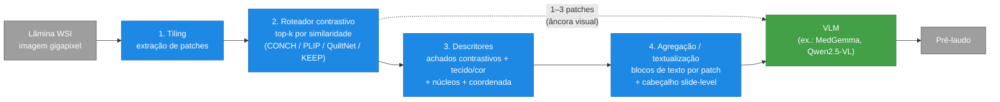

# Pipelines

## Pipeline Ideia 01 - 01/09/2026

### A bifurcação: por qual canal a informação do patch entra na VLM?

Uma VLM generativa só tem dois canais de entrada: tokens visuais (pixels → encoder de visão → tokens) e tokens de texto. Os "encoders e descritores" do passo 3 produzem vetores e números — e a VLM não ingere vetor de embedding nativamente. Há três saídas possíveis, e elas não são equivalentes:

- **A) Textualizar** — descritores viram texto e entram pelo canal de texto. Barato, sem treino, interpretável. É o que o PaperWVC mostrou competitivo.
- **B) Tokens visuais** — os pixels do patch entram pelo encoder da própria VLM. Nativo, preserva sinal cru, mas caro em token e limita k a pouquíssimos patches.
- **C) Ponte por embedding** — embedding do patch → projetor treinado → LLM. Poderoso, mas exige treinar o projetor (os 8 ciclos de debug do PaperWVC foram exatamente isso). Mata o ethos de "hardware modesto, sem cluster".

Para o OncoVLM (democratização, sem treino pesado), o caminho é A com um punhado de B como âncora, não C. E o número decide isso: um patch como imagem custa ~256–576 tokens visuais; 32 patches viram 8–18k tokens e estouram a VRAM de um 4B. Os mesmos 32 patches textualizados custam ~30–60 tokens cada → ~1–2k tokens, cabe folgado. Ou seja, textualizar não é só mais barato: deixa o k ser maior, cobrindo mais da lâmina pelo mesmo orçamento. Esse é o argumento central da eficiência, e ele é mensurável.

### Correção do objetivo do passo 3

"Obter o máximo de informação possível" é o alvo errado. Informação máxima por patch = reproduzir os pixels = compressão zero = derrota o propósito. O alvo é estatística suficiente para a pergunta: o mínimo que decide o diagnóstico, não o máximo. Trocar "máximo" por "suficiente e não-redundante" muda o design — inclusive obriga a deduplicar o top-k, que costuma devolver quase-duplicatas da mesma região tumoral (aproveitando a lógica de um gate de diversidade já usado em outro projeto do grupo).

### Descritores concretos, por custo de hardware

O descritor mais elegante para este caso é o contrastivo zero-shot: passar o patch por CONCH/PLIP/QuiltNet/KEEP contra um banco de frases ("tumor nests", "necrosis", "high nuclear pleomorphism", "mitotic figures", "dense stroma") e pegar as que mais casam. Ele já sai como texto, sem engenharia de vocabulário e sem projetor. Complementos possíveis:

- **Tecido/cor (CPU):** deconvolução H&E (Macenko) → razão hematoxilina/eosina, stats.
- **Núcleos (leve):** StarDist ou detector rápido → densidade, área média, proxy de pleomorfismo. CellViT é pesado demais para "modesto" — recomendado só se sobrar GPU.
- **Tipo de tecido:** cabeça de classificação linear sobre embedding de CTransPath (28M) ou Phikon (86M).
- **Coordenada do patch**, para a VLM raciocinar sobre arranjo espacial.

### Agregação (passo 4)

Cada patch vira um bloco de texto curto: [coord] achados contrastivos + 2-3 números-chave. Por cima, um cabeçalho slide-level (contagens agregadas, tecido dominante). Mantendo 1–3 patches como imagem real (âncora visual), a VLM ainda "vê" e ancora — é o hedge contra a textualização jogar fora tudo. A VLM então raciocina sobre evidência estruturada + âncoras e escreve o pré-laudo.

### Duas guardas necessárias

1. Textualizar herda os pontos cegos dos descritores: se o contrastivo erra, a VLM não recupera — ela nunca viu o pixel. Vale aplicar aqui o swap-control do PaperWVC: provar que a VLM usa os descritores e não recita prior de classe.
2. Top-k precisa de alvo. Rótulo fixo (BRACS-like) → ranqueia por saliência/atenção. VQA aberto → ranqueia por similaridade contrastiva com o texto da pergunta. Essa escolha precisa ser feita antes, porque muda o roteador.

### Pipeline recomendada (caminho A + âncora visual)

Já com o roteador contrastivo fazendo o top-k e a textualização como ponte principal:

Os quatro estágios em azul são a contribuição do projeto — é onde "tornar a imagem acessível" acontece. O cinza é entrada/saída e o verde é o modelo pronto, apenas orquestrado.

### Prioridades de pesquisa, em ordem

1. **O roteador contrastivo (estágio 2)** é o coração e o mais barato de defender: ele decide quanto da lâmina é pago em tokens. É onde a curva custo×fidelidade nasce — variando o k e medindo a acurácia. Um detalhe que muda o design: se a tarefa for VQA aberto, o roteador ranqueia por similaridade com o texto da pergunta; se for rótulo fixo, por saliência. Essa decisão precisa ser tomada antes de codar, porque o retriever é diferente nos dois casos.
2. **Os descritores (estágio 3)** são onde mora o trade-off real: o contrastivo zero-shot já sai como texto e é grátis de ligar, mas herda os pontos cegos do modelo. Recomenda-se começar só com ele + coordenada, medir, e só adicionar núcleos/cor se a curva pedir. Extrair "tudo" é uma tentação a evitar — cada descritor a mais é token a mais na VLM, e a maioria não move a acurácia.
3. **Um risco de arquitetura que o diagrama esconde:** a agregação (estágio 4) tem um teto de token que cresce linear com k. 32 patches textualizados cabem; 32 patches como âncora visual não. Por isso a âncora é 1–3, não 10 — é hedge, não canal principal.
4. **A peça que falta na metodologia atual** (que só mede memória/VRAM): cada seta desse fluxo perde sinal, e é necessário medir a perda em cada seta — tecido → top-k → descritor → VLM. Sem isso, não é possível saber se um pré-laudo ruim é culpa do roteador que jogou fora o patch certo, do descritor que não viu a mitose, ou da VLM que ignorou o texto. É a mesma cadeia de "suficiência" do PaperWVC, aplicada aqui como diagnóstico da própria pipeline.
